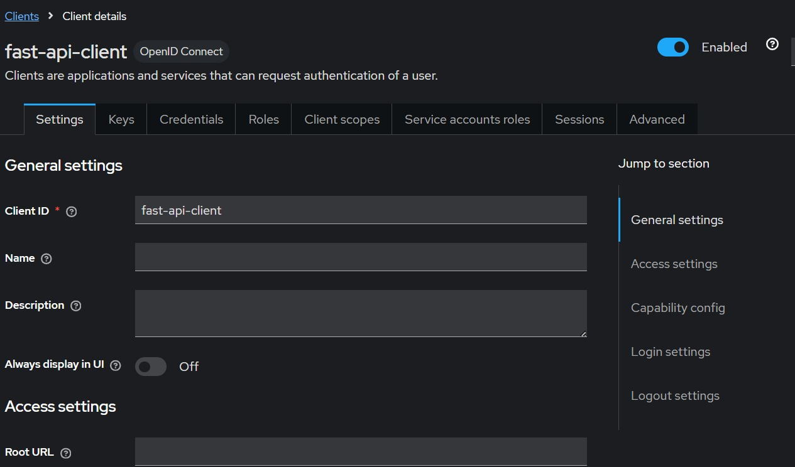

# Asegurando una API con OpenID Connect y OAuth usando Keycloak

Este ejercicio consiste en la creación de un API RESTful que utiliza Keycloak para manejar la autenticación de usuarios y  generar tokens de acceso.

**Grupo 5 - Integrantes:**
- Alejandro Martínez
- Alejandro Ortega
- Arturo Argueta
- Astrid Glauser
- Josué Argueta

## Tecnologías utilizadas

- Python/FastApi
- NodeJS
- Keycloak
- Docker
- Postman

## Instrucciones de uso

1. Descargar la imagen de Keycloak para docker utilizando el siguiente comando:

    ```sh
    docker pull quay.io/keycloak/keycloak
    ```

2. Correr el contenedor:
    
    ```sh
    docker run -p 8080:8080 -e KC_BOOTSTRAP_ADMIN_USERNAME=admin -e KC_BOOTSTRAP_ADMIN_PASSWORD=admin quay.io/keycloak keycloak:latest start-dev
    ```

3. Abrir la interfaz de Keycloak y crear el realm:

    Una vez se esté ejecutando el contenedor, podemos abrir la interfaz ingresando a `http://localhost:8080/admin`.

    Ya dentro de la interfaz, podemos crear un realm llamado `FastApi`, asegurándonos de habilitar `Client authentication` para establecer el tipo de acceso como **confidencial**.

4. Crear el cliente y un usuario:

    Habiendo creado el realm, podemos crear el cliente ingresando al apartado de `Clients` y haciendo click en `Create client`. Nombraremos el cliente como `fast-api-client`.

    A continuación se ven capturas de la configuración del cliente:

    
    
    

    También necesitaremos crear un usuario desde el apartado `Users` utilizando el botón `Create new user`. Una vez creado el usuario, debemos agregarle una contraseña haciendo click en `Credentials` y `Set password`, asegurándonos de desactivar la opción `Temporary` para que la contraseña no sea temporal.

5. Instalar las dependencias del API:

    Antes de correr el API debemos instalar las dependencias utilizando:

    ```node
    npm install
    ```

6. Correr el API:

    Para correr el api ejecutamos el siguienye comando:

    ```node
    node app.js
    ```

7. Pruebas con Postman:

    Una vez que esté corriendo tanto el API, como la instancia de Keycloak, podemos hacer pruebas desde Postman para verificar que la autenticación del usuario está funcionando correctamente.

    A continuación hay capturas de las pruebas realizadas para cada endpoint y la solicitud del token de acceso:

    Token request:
    

    Public endpoint:
    
    
    Private endpoint:
    
    
    Data endpoint:
    